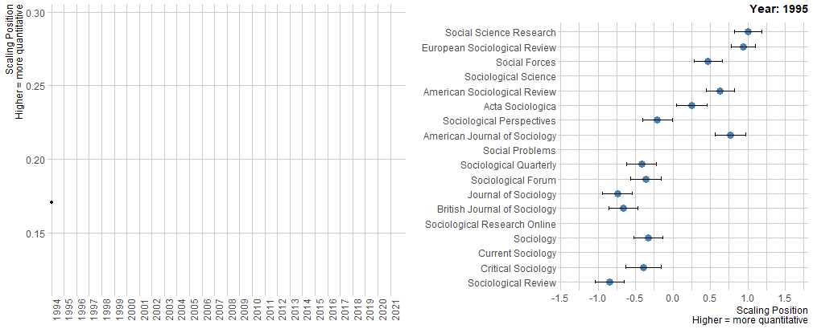

class: top, left

```{r setup, include=FALSE} 
knitr::opts_chunk$set(
  fig.width = 10, fig.height = 6, fig.retina = 2,
  warning = FALSE, message = FALSE
)
```  

```{r xaringan-themer, include=FALSE, warning=FALSE}
library(xaringanthemer)
style_mono_light(
  base_color = "#293352",
#  header_font_google = google_font("Josefin Sans"),
#  text_font_google   = google_font("Montserrat", "300", "300i"),
#  code_font_google   = google_font("Fira Mono")
)
# Course logo colour match
# "#C4961A", "#FC4E07", "#D16103", "#52854C", "#293352"
```

```{r xaringanExtra, echo = FALSE}
xaringanExtra::use_progress_bar(color = "#0051BA", location = "bottom")
```
  
```{r required-packages, eval=FALSE, include=FALSE}
devtools::install_github("gadenbuie/metathis@05f8ba1f")
devtools::install_github("gadenbuie/countdown@5c895d980")
devtools::install_github("gadenbuie/xaringanExtra")
install.packages("moffitdocs")        #<< no longer available?
install.packages("xaringanthemer")  
```

## The lecture slides will be available later on Monday
<br>Until then, check out something cool! <br>
--
.center[

]

--

<br>What do you think these graphs are telling us?

--

<br>To find out, read the article by Schwemmer and Wieczorek (2020) (‘The Methodological Divide of Sociology: Evidence from Two Decades of Journal Publications’, Sociology, 54(1), pp. 3–21)

--

<br> tip: It's on the reading list for Week 1!
