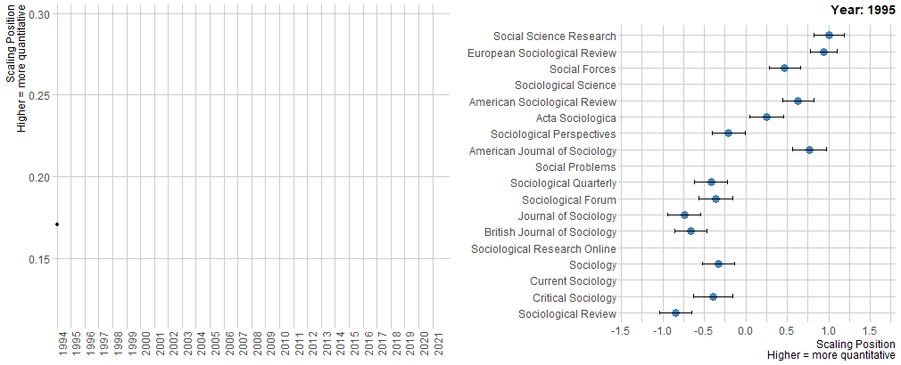
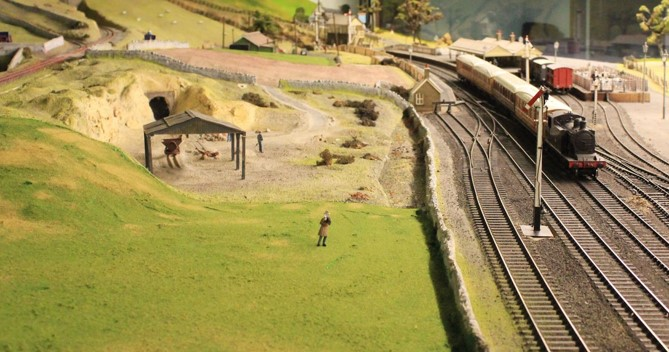

class: inverse, center, middle

```{r setup, include=FALSE} 
knitr::opts_chunk$set(
  fig.width = 10, fig.height = 6, fig.retina = 2,
  warning = FALSE, message = FALSE
)
```  

```{r xaringan-themer, include=FALSE, warning=FALSE}
library(xaringanthemer)
style_mono_light(
  base_color = "#293352",
#  header_font_google = google_font("Josefin Sans"),
#  text_font_google   = google_font("Montserrat", "300", "300i"),
#  code_font_google   = google_font("Fira Mono")
)
# Course logo colour match
# "#C4961A", "#FC4E07", "#D16103", "#52854C", "#293352"
```

```{r xaringanExtra, echo = FALSE}
xaringanExtra::use_progress_bar(color = "#0051BA", location = "bottom")
```
  
```{r required-packages, eval=FALSE, include=FALSE}
devtools::install_github("gadenbuie/metathis@05f8ba1f")
devtools::install_github("gadenbuie/countdown@5c895d980")
devtools::install_github("gadenbuie/xaringanExtra")
install.packages("moffitdocs")        #<< no longer available?
install.packages("xaringanthemer")  
```

# .blue[Week 1]

--

## Welcome to the module!

--

### ... and an introduction to statistical modelling for social researchers

---
class: top, left

# Session outline

--

## In the first half, I'll speak a lot:

--

### - Why quantitative sociology?
--
 .lightgrey[(have you looked at the motivational chart on Moodle and the associated reading?)]
 
--
### - Why **R** and **RStudio**?
--
 .lightgrey[(spoiler: something to do with what Freese an colleagues say in the two assigned readings?)]
 
--
### - Why statistical modelling?
--
 .lightgrey[(turning to hardcore ROS here)]

--
### - So what is this module about?
--
 .lightgrey[(Moodle page and all that)]

--
### - And how to do well on this module?
--
 .lightgrey[(looked at the Assessment Brief?)]

---
# Session outline
## In the second half, I'll relax with my .orange[coffee], read the news, check my Facebook, like some cat photos...
--
 while you:

--
#### - Fire up **RStudio**
--
 .lightgrey[and make a list of error messages that we need to report to the IT team]

--
#### - Practice some basic **R** coding
--
 .lightgrey[from the R4DS book]

--
#### - Create an **Rmarkdown** document 
--
 .lightgrey[(tip: the automatic template created is actually a mini-tutorial)]

--
#### - Locate and download the replication documentation associated with the article by Schwemmer and Wieczorek (2020)
--
 .lightgrey[ and check out the two documents titled *soc_journals_replication.Rmd* and *soc_journals_replication.nd.html*]

--
#### - You get all excited about **R** and stay here all night practicing
--
 .lightgrey[???]

---
layout: true
# Why quantitative sociology?

---
--
### Evans and Foster (2019):
- C. Wright Mills argued that sociologists should cultivate an imagination that connects individual experiences with large-scale social currents and places them in historical perspective. 
--
 Recent computational advances in the collection, analysis, and simulation of social data have cultivated an **expanded sociological imagination**.
 
--

- Sociology is the science of societies, concerned with their structure and culture, at large scales. 
--
 Sociologists are interested in **prediction**, **explanation**, and **interpretation**: three complementary modes of engaging with social data.

--

- Embracing our special vocation will require key changes in
the sociological curriculum. Graduate students should master
languages like Python, R, or Julia; these are **the common tongues** of machine learning and data science.

--

- Computation allows us to model, measure, and modify both social structures and the texture of individual experience ... on bigger and smaller scales than ever before. 
--
 **The sociological imagination has been blown wide open**.

---
### Schwemmer and Wieczorek (2020):
- Sociology is still divided methodologically
--
 along the artificial qualitative/ quantitative divide.
 
--


- Other disciplines (e.g. political science) have made better <br>progress over the past two decades.


--
- There is an overall trend towards more quantitative work
--
 employing both statistical and more broadly 'computational' methods

--

- This divide is reflected in academic journals and national professional associations

--

- Sociology might increasingly give way to an archipelago of sub-disciplines with their own domains of knowledge but a limited ability to produce new insights

---
<br>
.center[

]

---
layout: false
# Why R and RStudio?
- "Graduate students should master languages like Python, R, or Julia; these are **the common tongues** of machine learning and data science"

--

- Free, open source!
--
 You can use it without any institutional affiliation in the future.
--
 And in most workplaces, as it's becoming the most popular statistical software in both the public and private sector.
 
--

- Amazing power and versatility.
--
 You can start with the very basics (this course).
--
 But can develop your skills endlessly.
 
--

- You can follow best practice in publication and applied research work by implementing a **reproducible workflow**.
--
 With ease!
 
--

- <b>Freese (2007):</b><br>
A larger movement is afoot, and it will continue regardless of whether or when sociology chooses to take part. Sociologists feel the discipline’s valuable research contributions do not receive the outside attention they deserve. If quantitative sociologists are not willing to act to make their research practices as transparent and public as possible, then we will have no one to blame but ourselves if our work has less visibility and credibility.
 
---
# Why statistical modelling?
--

### What is a 'model'?

--

--
 

---
# Why statistical modelling?


### What is a 'model'?


---
# Why statistical modelling?


### What is a 'model'?


---
# Why statistical modelling?

### A group thought experiment:

--

#### Could I build a model to predict student satisfaction on this module?
--
 What would be the 'ingredients' of such a model?
 
--
- Some measure of the outcome: "satisfaction"

--

- Some measure(s) of predictor(s): ?

--
<br>
##### Satisfaction 
--
 ~ InstructorEffort 
--
 + StudentEffort
--
 + Resources
--
 + anything else?
 
--
$$
Y = \alpha + \beta X + \epsilon
$$
--

- Some immediate questions that emerge:

--
  * How should 'satisfaction' be measured?
--
 And does that affect my model?
--
 And if so, what to do?
 
--

 * How should the predictors be measured?
--
 And does that affect my model?
--
 And if so, what to do?

---
# What is this module about?

--

### About answering those immediate questions!

---

<iframe width="1500" height="500" src="https://moodle.yorksj.ac.uk/course/view.php?id=25703" frameborder="0" allowfullscreen></iframe>

---
# Coffe break!
--


