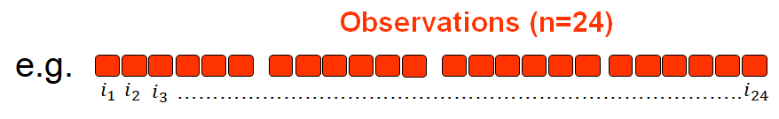
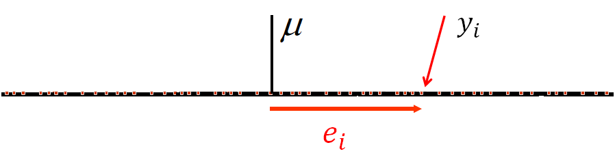
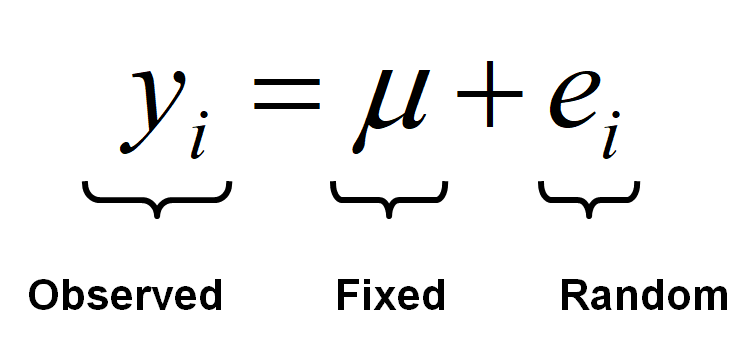
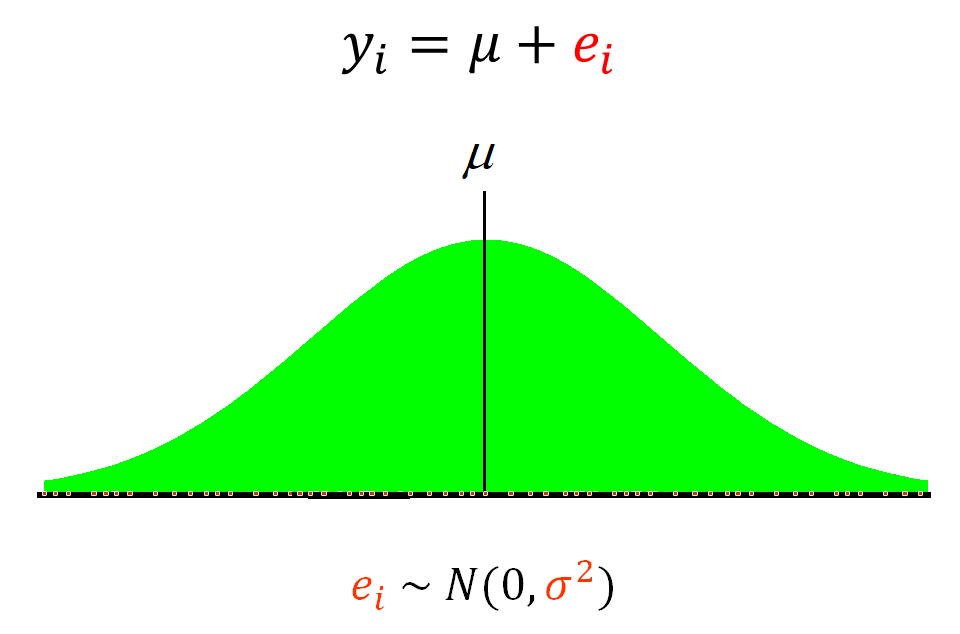
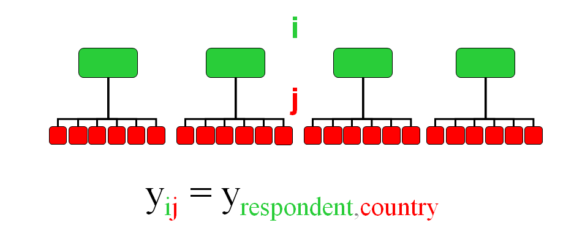
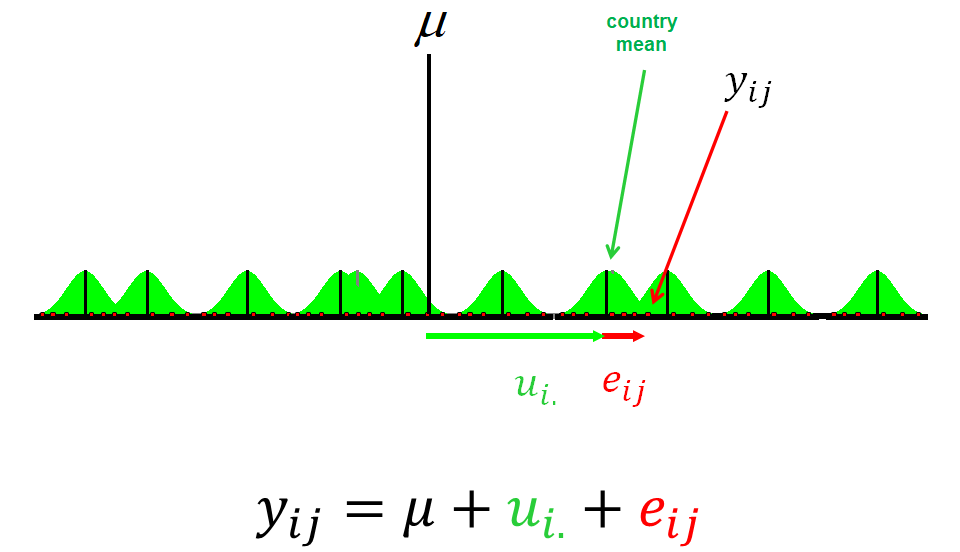
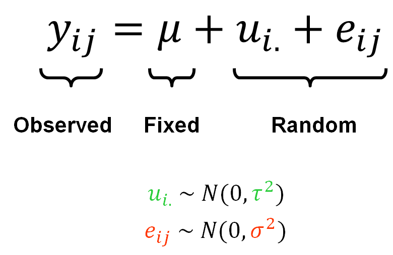

class: inverse, center, middle

```{r setup, include=FALSE} 
knitr::opts_chunk$set(
  fig.width = 10, fig.height = 6, fig.retina = 2,
  warning = FALSE, message = FALSE, options(digits = 5)
)
```  

```{r required-packages, eval=FALSE, include=FALSE}
devtools::install_github("gadenbuie/metathis@05f8ba1f")
devtools::install_github("gadenbuie/countdown@5c895d980")
devtools::install_github("gadenbuie/xaringanExtra")
install.packages("xaringanthemer")  
```

```{r xaringan-themer, include=FALSE, warning=FALSE}
library(xaringanthemer)
style_mono_light(
  base_color = "#293352",
#  header_font_google = google_font("Josefin Sans"),
#  text_font_google   = google_font("Montserrat", "300", "300i"),
#  code_font_google   = google_font("Fira Mono")
)
# Course logo colour match
# "#C4961A", "#FC4E07", "#D16103", "#52854C", "#293352"
```

```{r xaringanExtra, echo = FALSE}
# devtools::install_github("gadenbuie/xaringanExtra")
xaringanExtra::use_progress_bar(color = "#0051BA", location = "bottom")
```

```{r eval=FALSE, include=FALSE}
## Run all code to live preview the slides
xaringan:::inf_mr()
```


# .blue[Week 12]

--

## Multilevel/longitudinal models

---

# A brief review of single-level regression

--

- We aim to model an **outcome** measurement, our ['estimand'](https://journals.sagepub.com/doi/10.1177/00031224211004187): $\color{green}{Y}$

--

- We have data on a number $(n)$ of **observations** $(\color{red}{i})$ (e.g. survey respondents; pupils; students; factory workers; etc.): $\color{red}{i}_{1\dots{n}}$

--

- We assume that observations are **independent** of each other (e.g. different respondents randomly sampled from a population)

--

.center[

]

--

- The outcome measurement has a mean $(\mu)$, and each observation has some deviation ("error") from this grand mean $(e_i)$

--


<br>

### $$ y_i = \mu + \color{red}{e_i} $$ 

???
- Independence of observation is usually assumed if the data collection was done properly using random sampling techniques; in practice, it also means that individual observations should not be strongly clustered into larger groups that may have a strong group-effect that shapes individual characteristics; for example, if data is collected cross-nationally, respondents from different countries can share characteristics specific to that country, shaped by historical, cultural, social, ethical etc. influences that affect everyone in that national context; or, a classicla example of hierarchical/multilevel data, when pupitls/students belong to different shools/universities; or people living in different regions of a country; or workers belonging to different factories; etc, etc.

---
# A brief review of single-level regression

.center[]

--

- **Observed** part: our observation, outcome, estimate, etc.; the left-hand-side of the model 

--

- **Fixed** part: this can be a simple sample mean $(\mu)$ of a single measurement (e.g. an election exit poll), but it can also be a regression equation also containing predictor variables (e.g. $b_0 + b_{1i}x_{1i} + b_{2i}x_{2i} \cdots b_{pi}x_{pi}$ for a model with $p$ number of predictors/independent variables)

--

- **Random** part: the deviations of the observations from the model mean

---
# A brief review of single-level regression

- We also assume that the error term $(e)$ is Normally distributed around a mean of 0 and has some variance $(\sigma^2)$ that we are estimating

<br>
.center[]

???
- in regression we also make some assumptions regarding the distribution of errors:
- that they are Normally distributed, with a mean of 0 and some variance (the square of the standard deviation)
- we are estimating this variance about that sample mean

---

# Applied example from Weeks 4 and 6 

```{r include=FALSE}

# Load/install necessary packages

pacman::p_load(
  tidyverse,   # general data management tools
  mosaic,      # formula-type syntax for descriptive statistics
  ggformula,   # ggplot2 powered graphing using 'mosaic' formula-syntax
  summarytools,# summery statistics tables
  kableExtra,  # publication-quality tabulation
  sjlabelled,  # data import from other software (alternative to 'haven') and labels management
  knitr,       # exporting .Rmd to Word, Html etc.
  jtools,     # model summary tabulations
  lme4         # multilevel modelling
  )
```

Let's use some selected variables and observations from the Österman (2021) dataset underpinning the article ["Can We Trust Education for Fostering Trust? Quasi-experimental Evidence on the Effect of Education and Tracking on Social Trust"](http://www.diva-portal.org/smash/get/diva2:1503902/FULLTEXT01.pdf), which we have explored in previous weeks.

```{r import data, include=FALSE}
set.seed(1234)
ost <- haven::read_dta("https://cgmoreh.github.io/SSC7001M/data/osterman.dta") %>%
        select("trustindex3", "cntry", "facntr", "mocntr", "female", "agea", "eduyrs25", "paredu_a_high") %>%
        filter(cntry %in% c("GB", "IE", "DE", "FR", "HU", "PL", "PT", "ES")) %>%  
        group_by(cntry) %>% slice_sample(n=50) %>%
        labelled::unlabelled() %>% as_tibble() %>%
        mutate(cntry = as_factor(cntry),
               fmnoncntr = ifelse(facntr==0 | mocntr==0, 1, 0)) %>%
        sjlabelled::var_labels(trustindex3 = "Social trust scale",
                               eduyrs25 = "Years of full-time education",
                               paredu_a_high = "High parental education",
                               fmnoncntr = "Least one parent born abroad")
```

The 'Country' variable - and our data - looks like this:

```{r echo=FALSE}
# Another frequency table of the "Country" variable after data processing
summarytools::freq(ost$cntry)
```


---
# Applied example from Weeks 4 and 6 

A summary of the variables kept:
```{r echo=FALSE}
summarytools::descr(ost,
      stats     = c("mean", "sd", "med", "min", "max", "n.valid"),
      transpose = TRUE,
      style="rmarkdown",
      # headings  = FALSE ## uncomment this option to exclude the summary heading preceding table
      )
```

---
# Applied example from Weeks 4 and 6

A single-level linear model:

```{r echo=FALSE}
lm(trustindex3 ~ eduyrs25 + agea + female + paredu_a_high + fmnoncntr, data = ost) %>%
jtools::summ()
```

---
# Multilevel models

.center[]

--

.center[]

---
# Multilevel models

.center[]
