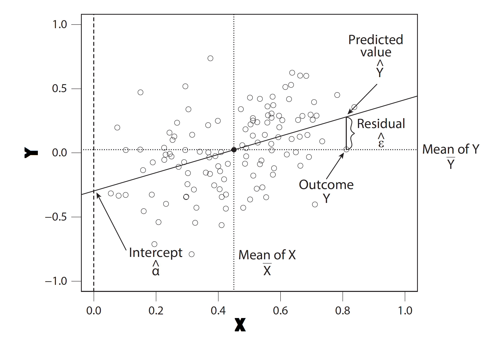
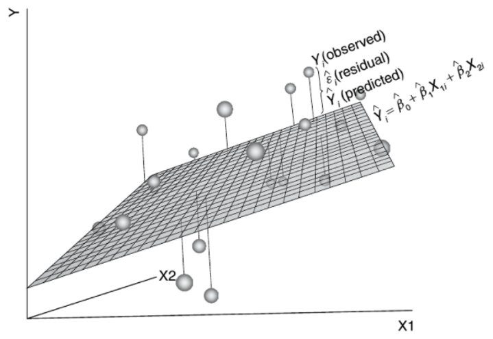

class: inverse, center, middle

```{r setup, include=FALSE} 
knitr::opts_chunk$set(
  fig.width = 10, fig.height = 6, fig.retina = 2,
  warning = FALSE, message = FALSE, options(digits = 5)
)
```  

```{r xaringan-themer, include=FALSE, warning=FALSE}
library(xaringanthemer)
style_mono_light(
  base_color = "#293352",
#  header_font_google = google_font("Josefin Sans"),
#  text_font_google   = google_font("Montserrat", "300", "300i"),
#  code_font_google   = google_font("Fira Mono")
)
# Course logo colour match
# "#C4961A", "#FC4E07", "#D16103", "#52854C", "#293352"
```

```{r xaringanExtra, echo = FALSE}
# devtools::install_github("gadenbuie/xaringanExtra")
xaringanExtra::use_progress_bar(color = "#0051BA", location = "bottom")
```
  
```{r required-packages, eval=FALSE, include=FALSE}
devtools::install_github("gadenbuie/metathis@05f8ba1f")
devtools::install_github("gadenbuie/countdown@5c895d980")
devtools::install_github("gadenbuie/xaringanExtra")
install.packages("moffitdocs")        #<< no longer available?
install.packages("xaringanthemer")  
```


# .blue[Week 6]

--

## Prediction and causality

---
# Prediction vs. causality

- **Predictive inference**: given the values of several inputs ( $X$), a fitted
model allows us to predict $y$, typically considering the $n$ data points as a simple random sample from a hypothetical infinite “superpopulation”

- **Causal inference**: what would happen to an outcome $y$ as a result of a treatment, intervention, or exposure $z$, given pre-treatment information $x$. 

- Causal effects seen as a comparison between different *potential outcomes* of what might have occurred under different scenarios (counterfactual states) (see also Morgan and Winship (2014))

- We assume the existence of potential outcome random variables ( $Y^{1 (treated)}$, and $Y^{0 (control)}$) that are defined over all individuals in the population of interest

--

## $$ \delta_i = y_i^1 - y_i^0 $$

** $\delta$ is read "delta" and usually denotes change in statistical equations

---
# The problem of causality

- The fundamental problem of causal inference: we can never observe both potential outcomes $y_i^1$ and  $y_i^0$ for the same  individual. Therefore, we cannot determine any individual causal effect without further assumptions.

- Assuming treatments are randomly assigned, we can estimate an *average* causal effect, but this still only applies to individuals if we are willing to also assume that effects are constant across people

- Assessing causal mechanisms require specific data types that are able to capture causality.

---
# Causal data

- **Experimental data**: collected from an experimental research design, in which a treatment variable, or a causal variable of interest, is manipulated in order to examine its causal effects on an outcome variable

   - **Randomized experiments**: a.k.a. 'Randomized Controlled Trials' (RCTs); in which researchers randomly assign the receipt of treatment. Regarded as the gold standard for establishing causality because it enables researchers to isolate the effects of a treatment variable and quantify uncertainty
   
   - **Natural experiments**: “a real world situation that produces haphazard assignment to a treatment” (Rosenbaum 2010: 67)

---
# Causal data

- **Observational data**: researchers simply observe naturally occurring events and collect and analyse the data. In such studies, internal validity is likely to be compromised because of possible selection bias. However, findings from observational studies are typically more generalizable because we can examine the treatments that are implemented among a relevant population in a real-world environment.

  - **Longitudinal**: Observing units (individuals, countries etc.) several times; longer time-series for aggregate units (e.g. country-level measures across time). Allows for the temporal dimension to be modelled; in such designs, causal effects can be approximated by assessing change over time within units
  
  - **Cross-sectional**: Data collected only at one time-point for each unit (most of the data we have explored so far)

---


---


---
# A brief review of simple regression

### What is simple (bivariate) linear regression?

- **Simple**: it involves one *response* (dependent; outcome) variable and only one *explanatory* (independent; predictor) variable

- **Linear**: we assume that a one-unit change in the independent variable leads to a certain amount of increase or decrease in the dependent variable

- **Regression**: the term originated in Francis Galton's studies of biological inheritance, specifically his 1886 article “Regression towards mediocrity in hereditary stature", published in the *Journal of the Anthropological Institute of Great Britain and Ireland* (vol. 15, pp. 246–263)

- At its simplest, it helps us evaluate whether there is a linear relationship between a *numerical* variable on a horizontal axis and the average of a *numerical* variable on the vertical axis. It provides a mathematical solution to the question: what is the *best fitting* straight line to capture the relationship of two variables in a *scatter plot*?

---
# A brief review of simple regression

### What is simple (bivariate) linear regression?

- A statistical method for fitting a line to data where the relationship between two variables, $x$ and $y,$ can be modeled by a straight line with some error:

### $$  \overbrace{\color{green}{\textbf{y}}}^{outcome} = b_0 + b_1 * \overbrace{\color{green}{\textbf{x}}}^{predictor} + e$$

- A dataset normally contains a collection of values for $y$ and $x$ from a number $(N)$ of cases (e.g. survey respondents, or another unit of analysis)
- For example, each row $i$ in a dataset containing $N=1\dots{n}$ cases/units/rows would store values for $y_i$ and $x_i$
- so that: 
$$ y_i=b_0+b_1x_i + e_i $$

---
# A brief review of simple regression

### What is simple (bivariate) linear regression?

### $$  \overbrace{\color{green}{\textbf{y}}}^{outcome} = \overbrace{\color{red}{b_0}}^{intercept} + \overbrace{\color{red}{b_1}}^{slope} * \overbrace{\color{green}{\textbf{x}}}^{predictor} + \overbrace{e}^{error;\ residual} $$

- our aim is to calculate values for the $b_0$ and $b_1$ based on our data
- the intercept $b_0$ (or $\alpha$, as it is also sometimes notated) represents the average value of $y$ when $x$ is zero
- the slope $b_1$ measures the average increase in $y$ when $x$ increases by one unit
- together, $b_0$ and $b_1$ together are called *coefficients*
- the error term $e$ allows an observation to deviate from a perfect linear relationship
- More generally, our aim is to generalise from our *sample* data to a hypothetical *population*. The mathematical notation to describe this general case is:

$$ Y=\beta_0 + \beta_1*X+\epsilon $$
---
# A brief review of simple regression

For example, say we have data on two variables, $X$ and $Y$; both are continuous measures with means of 0.48 and 0.006, respectively, and some standard deviation (i.e. they have variation among values):
.center[

]
---

# A brief review of simple regression
<br>
### What are the aims of regression analysis?
- ** Prediction**: we can use regression to predict an outcome variable, or more precisely the distribution of the outcome, given some set of inputs (i.e. predictors)

- ** Comparison**: we can also compare these predictions for different values
of the inputs, to make simple comparisons between groups, or to estimate causal effects (ROS, p. 81)

---
# Applied regression

```{r, include=FALSE}
library(tidyverse)
library(mosaic)
library(ggformula)
library(kableExtra)
```

--
Data from Österman (2021) "Can We Trust Education for Fostering Trust? Quasi-experimental Evidence on the Effect of Education and Tracking on Social Trust"

```{r import data, include=TRUE}
## Load the Osterman data:
osterman <- haven::read_dta("https://cgmoreh.github.io/SSC7001M/data/osterman.dta")
```

- cumulative European Social Survey (ESS) data, consisting
of the nine rounds from 2002 to 2018

- data are weighted using ESS design weights (we will disregard this, sowe can expect our results to always differ somewhat!)

- follows 'the established approach of using a validated three-item scale' to study generalised social trust

- data also includes twenty-seven educational reforms implemented in sixteen European countries over six decades, where for each reform we can compare earlier reform-unaffected cohorts with later reform-affected cohorts

---
# Applied regression

Data from Österman (2021) "Can We Trust Education for Fostering Trust? Quasi-experimental Evidence on the Effect of Education and Tracking on Social Trust"

- The scale consists of the classic trust question, an item on whether people try to be fair, and an
item on whether people are helpful:
  - ‘Generally speaking, would you say that most people can be trusted, or that you can’t be too careful in dealing with people?’
  - ‘Do you think that most people would try to take advantage of you if they got the chance, or would they try to be fair?’
    - ‘Would you say that most of the time people try to be helpful or that they are mostly looking out for themselves?’
    
- All of the items may be answered on a scale from 0 to 10 (where 10 represents the highest level of trust) and the scale is calculated as the mean of the three items

- The three-item scale improves measurement reliability and cross-country validity compared to using a single item, such as the classic trust question.

---

```{css, echo = F}
table {
  font-size: 13px;     
}
```
## Descriptive statistics


```{r echo=FALSE}
my.summary <- function(x, na.rm=TRUE){
  result <- c(N=length(x[!is.na(x)]),
              Mean=round(mean(x, na.rm=na.rm), 3),
              SD=round(sd(x, na.rm=na.rm), 3),
              Min=min(x, na.rm=na.rm),
              Max=max(x, na.rm=na.rm))
}


sumtab <- data.frame(sapply(osterman, my.summary)) %>% select(-(cntry:dweight))

knitr::kable(data.frame(t(sumtab)), caption = "Table 2 in Österman (2021)")
```

---
## Does education predict trust?

- A scatter-plot of 'trustindex3' by 'eduyrs25'

```{r, echo=FALSE}
gf_point(trustindex3 ~ eduyrs25, data = osterman) %>%
  gf_lm() + theme_light()
```

---
## Does education predict trust?
```{r}
m_edu <- lm(trustindex3 ~ eduyrs25, data = osterman)
summary(m_edu)
```

---
## Does age predict trust?
```{r echo=FALSE}
gf_point(trustindex3 ~ agea, data = osterman) %>%
  gf_lm() + theme_light()
```

---
## Does age predict trust?

```{r}
m_age <- lm(trustindex3 ~ agea, data = osterman)
summary(m_age)
```

---
## Does gender predict trust?
```{r echo=FALSE}
gf_point(trustindex3 ~ female, data = osterman) %>%
  gf_lm() + theme_light()
```

---
## Does gender predict trust?

```{r}
m_gender <- lm(trustindex3 ~ female, data = osterman)
summary(m_gender)
```

---
# Multiple linear regression

- it allows us to test the joint effects of more than one predictor

- usually, we are interested in one primary predictor, but *while taking into account*, or *holding constant* the values of other predictors
- it allows us to account for the possible effect of other factors (variables) that may influence our regression results

- the multiple regression model for $p$ number of predictors can be written as:
#### $$  Y = \beta_0 + \beta_1 \ X_1 + \beta_2 \ X_2 + \beta_3 \ X_3 + \dots + \beta_p \ X_p + e $$

- but visualising it is a bit more difficult...

---
# Multiple linear regression

.center[

]

---
# Applied multiple regression

## Does education predict trust, while accounting for age and gender?

```{r, eval=FALSE, include=TRUE}
## Load the Osterman data:
osterman <- haven::read_dta("https://cgmoreh.github.io/SSC7001M/data/osterman.dta")
```

```{r, eval=FALSE, include=TRUE}
m_multiple <- lm(trustindex3 ~ eduyrs25 + agea + female, data = osterman)
summary(m_multiple)
```

---
# Applied multiple regression

### Does education predict trust, while accounting for age and gender?

```{r}
m_multiple <- lm(trustindex3 ~ eduyrs25 + agea + female, data = osterman)
summary(m_multiple)
```

---
class: inverse, center, middle

<br><br>
# Coffee break!
.center[

]

---
# Exercises

## 1. In a new Rmd file, reproduce the multiple regression of trust on education, age and gender

## 2. Build a new regression which **also** includes 'paternal education' and 'belonging to an ethnic minority group'

## 3. Using the Osterman data, does 'institutional trust' predict generalised social trust if we account for age, gender and whether parents were born outside Europe?

## 4. Free exercise using **your own** data!