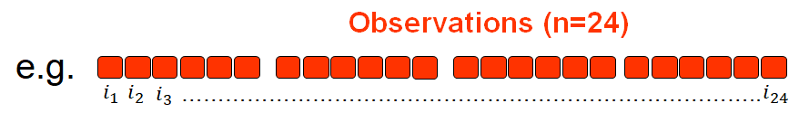
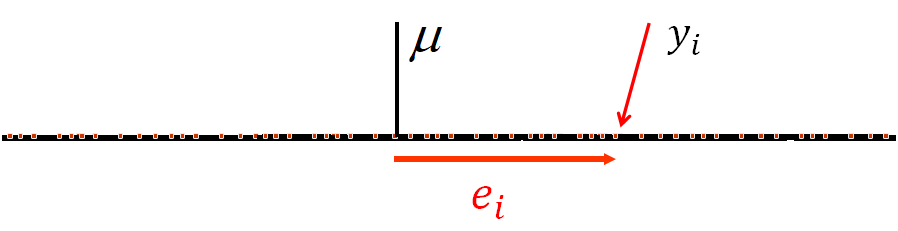
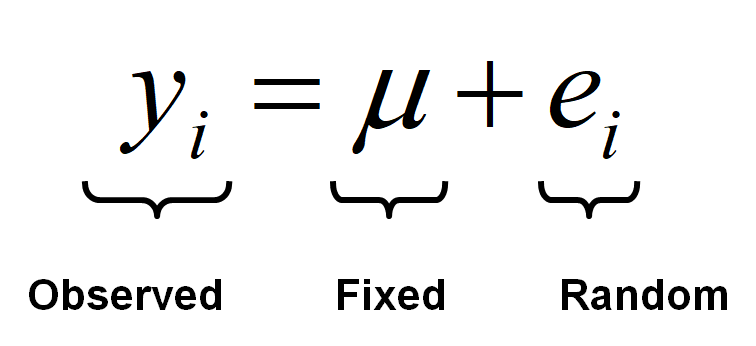
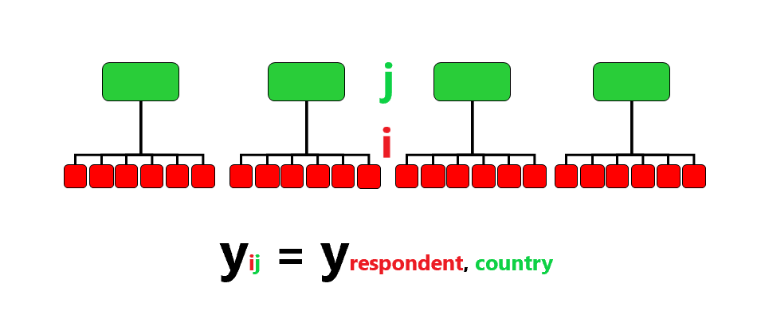
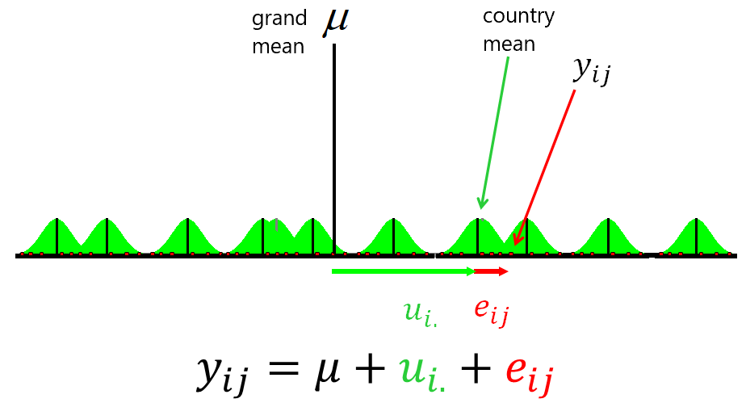
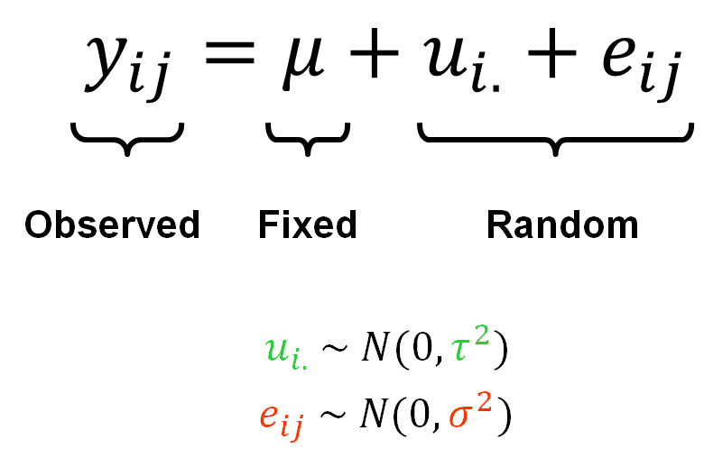

class: inverse, center, middle

```{r setup, include=FALSE} 
knitr::opts_chunk$set(
  fig.width = 10, fig.height = 6, fig.retina = 2,
  warning = FALSE, message = FALSE, options(digits = 5)
)
```  

```{r required-packages, eval=FALSE, include=FALSE}
devtools::install_github("gadenbuie/metathis@05f8ba1f")
devtools::install_github("gadenbuie/countdown@5c895d980")
devtools::install_github("gadenbuie/xaringanExtra")
install.packages("xaringanthemer")  
```

```{r xaringan-themer, include=FALSE, warning=FALSE}
library(xaringanthemer)
style_mono_light(
  base_color = "#293352",
  )
```

```{r xaringanExtra, echo = FALSE}
# devtools::install_github("gadenbuie/xaringanExtra")
xaringanExtra::use_progress_bar(color = "#0051BA", location = "bottom")
```

```{r eval=FALSE, include=FALSE}
## Run all code to live preview the slides
xaringan:::inf_mr()
```


# .blue[Week 10]

## Multilevel models

---
# Where R we?

Week 1: ~~Introduction to statistical modelling~~

Week 2: ~~Measurement and categorisation~~

Week 3: ~~Linear regression with one predictor~~

Week 4: ~~Linear regression with multiple predictors~~

Week 5: ~~Linear regression with interaction terms~~

Week 6: ~~Prediction and causality~~

Week 7: ~~Probability and odds~~

Week 8: ~~Logistic regression~~

Week 9: ~~Multicategory logistic regression~~

.blue[**Week 10: Multilevel models**]

Week 11: Longitudinal models

Week 12: Assessment clinic

---

# A brief review of single-level regression

--

- Let's start with a very simple example

--

- We aim to model an **outcome** measurement, our ['estimand'](https://journals.sagepub.com/doi/10.1177/00031224211004187): $\color{green}{Y}$

--

- We have data on a number $(n)$ of **observations** $({i})$ (e.g. survey respondents; pupils; students; factory workers; events; etc.): ${i}_{1\dots{n}}$

--

- We assume that observations are **independent** of each other (e.g. different respondents randomly sampled from a population)

--

.center[

]

--

- The outcome measurement has a grand mean across all observations $(\mu)$, and each observation $(i)$ has some deviation ("error") from this mean $(e_i)$

--


<br>

### $$ y_i = \mu + \color{red}{e_i} $$ 

---
# A brief review of single-level regression

.center[]

--

- **Observed** part: our observation, outcome, estimate, etc.; the left-hand-side of the model 

--

- **Fixed** part: this can be a simple sample mean $(\mu)$ of a single measurement as in our basic example (e.g. a social trust scale), but it can also be a regression equation containing several predictor variables, as we have seen in previous weeks (e.g. $b_0 + b_{1i}x_{1i} + b_{2i}x_{2i} \cdots b_{pi}x_{pi}$ for a model with $p$ number of predictors/independent variables)

--

- **Random** part: the deviations of the observations from the model mean

---
# A brief review of single-level regression

- We also assume that the error term $(e)$ is Normally distributed around a mean of 0 and has some variance $(\sigma^2)$ that we are estimating

<br>
.center[]

---
# A brief review of single-level regression
####  An applied example (see Weeks 4-6)

```{r include=FALSE}

# Load/install necessary packages

pacman::p_load(
  tidyverse,   # general data management tools
  mosaic,      # formula-type syntax for descriptive statistics
  ggformula,   # ggplot2 powered graphing using 'mosaic' formula-syntax
  summarytools,# summery statistics tables
  kableExtra,  # publication-quality tabulation
  sjlabelled,  # data import from other software (alternative to 'haven') and labels management
  knitr,       # exporting .Rmd to Word, Html etc.
  jtools,     # model summary tabulations
  lme4         # multilevel modelling
  )
```

We'll use data from the Österman (2021) article ["Can We Trust Education for Fostering Trust? Quasi-experimental Evidence on the Effect of Education and Tracking on Social Trust"](http://www.diva-portal.org/smash/get/diva2:1503902/FULLTEXT01.pdf):

```{r, include=TRUE, eval=FALSE}
## Load the Österman data using the 'read_dta' function from the 'haven' package
osterman <- haven::read_dta("https://cgmoreh.github.io/SSC7001M/data/osterman.dta")
```

```{r include=FALSE}
osterman <- haven::read_dta("../data/osterman.dta")
```

- cumulative European Social Survey (ESS) data, consisting of nine rounds from 2002 to 2018

- data are weighted using ESS design weights (we will disregard this, so we can expect our results to differ somewhat)

- follows 'the established approach of using a validated three-item scale' to study generalised social trust

---
# A brief review of single-level regression
####  An applied example (see Weeks 4-6)

The outcome variable of interest is an eleven-point scale measure of 'social trust':

- The scale consists of the classic trust question, an item on whether people try to be fair, and an
item on whether people are helpful:
  - ‘Generally speaking, would you say that most people can be trusted, or that you can’t be too careful in dealing with people?’
  - ‘Do you think that most people would try to take advantage of you if they got the chance, or would they try to be fair?’
    - ‘Would you say that most of the time people try to be helpful or that they are mostly looking out for themselves?’
    
- All of the items may be answered on a scale from 0 to 10 (where 10 represents the highest level of trust) and the scale is calculated as the mean of the three items

- The three-item scale improves measurement reliability and cross-country validity compared to using a single item, such as the classic trust question.

---
# A brief review of single-level regression
####  An applied example (see Weeks 4-6)

We'll select a few variables of interest to keep:

```{r}
osterman <- osterman %>%
  select("trustindex3", "cntry", "facntr", "mocntr", "female", "agea", "eduyrs25", "paredu_a_high")
```

And we'll do some data wrangling (see Week 4 Notes); we'll also reduce the dataset for the purpose of our demonstrations to make it run faster.

```{r}

set.seed(1234)

osterman <- osterman %>%
  labelled::unlabelled() %>% as_tibble() %>%
  filter(cntry %in% c("GB", "IE", "DE", "FR", "HU", "PL", "PT", "ES")) %>%  
  group_by(cntry) %>% slice_sample(n=50) %>% ungroup() %>%
  mutate(cntry = as_factor(cntry),
         fmnoncntr = ifelse(facntr==0 | mocntr==0, 1, 0)) %>%
  sjlabelled::var_labels( trustindex3 = "Social trust scale",
                          eduyrs25 = "Years of full-time education",
                          paredu_a_high = "High parental education",
                          fmnoncntr = "Least one parent born abroad"
                        )
```


---
# A brief review of single-level regression
####  An applied example (see Weeks 4-6)

Our variables of interest look like this:

```{r echo=FALSE}
x <- summarytools::descr(osterman,
      stats     = c("mean", "sd", "med", "min", "max", "n.valid"),
      transpose = TRUE,
      style="rmarkdown",
      headings  = FALSE ## uncomment this option to exclude the summary heading preceding table
      )

print(x, method = "render", footnote=NA)
```


---
# A brief review of single-level regression
####  An applied example (see Weeks 4-6)

The 'country' variable

```{css, echo = F}
table {
  font-size: 14px;     
}
```

```{r echo=FALSE}
# Another frequency table of the "Country" variable after data processing
x <- summarytools::freq(osterman$cntry,
                   headings = FALSE)

print(x, method="render", footnote=NA)
```

---
# A brief review of single-level regression
####  An applied example (see Weeks 4-6)

Let's start by fitting a single-level model of social trust as a function of education, age, gender, parental education and whether either of the parents were born abroad (i.e. the variable we computed earlier).

Mathematically, we fit the following model:

$$trustindex3=\beta_0+\beta_1*eduyears25+\beta_2*agea+\beta_3*female+\\ +\beta_4*{paredu}+\beta_5*{fmnoncntr}+error$$

---
# A brief review of single-level regression
####  An applied example (see Weeks 4-6)

Model summary:

```{r echo=FALSE, render='normal_print'}

lm(trustindex3 ~ eduyrs25 + agea + female + paredu_a_high + fmnoncntr, data = osterman) %>%
jtools::summ(confint=T, digits=3)
```

We have interpreted this model in earlier weeks. Our interest now is in extending it to account for the nesting of cases within different countries.

---
# Multilevel models

In our dataset we cannot assume that the observations are fully independent (or that the errors are independently distributed). We know that observations were sampled from within selected countries, so the countries are cluster variables that may have a group-level influence on the behaviour, opinions, conditions etc. of our individual observations.

--

.center[]

---
# Multilevel models

In our dataset we cannot assume that the observations are fully independent (or that the errors are independently distributed). We know that observations were sampled from within selected countries, so the countries are cluster variables that may have a group-level influence on the behaviour, opinions, conditions etc. of our individual observations.

.center[]

---
# Multilevel models

In our dataset we cannot assume that the observations are fully independent (or that the errors are independently distributed). We know that observations were sampled from within selected countries, so the countries are cluster variables that may have a group-level influence on the behaviour, opinions, conditions etc. of our individual observations.

.center[]


---
# Multilevel models

In our dataset we cannot assume that the observations are fully independent (or that the errors are independently distributed). We know that observations were sampled from within selected countries, so the countries are cluster variables that may have a group-level influence on the behaviour, opinions, conditions etc. of our individual observations.

.center[]

---
# Multilevel models

In our dataset we cannot assume that the observations are fully independent (or that the errors are independently distributed). We know that observations were sampled from within selected countries, so the countries are cluster variables that may have a group-level influence on the behaviour, opinions, conditions etc. of our individual observations.

With such data, it makes sense to allow regression coefficients to vary by group.

Such variation can already be achieved by simply including group indicators in a least squares regression framework.

--

In other words, we could extend our previous model like such:

$$trustindex3=\beta_0+\beta_1*eduyears25+\beta_2*agea+\beta_3*female+\\ +\beta_4*{paredu}+\beta_5*{fmnoncntr}+\color{red}{\beta_6*{cntry}}+error$$

--

**TASK: fit the above model and interpret the results**


---
# Multilevel models

Very often, simply including group indicators in a least squares regression gives unacceptably noisy estimates. 

Instead, we use 'multilevel regression', a method of partially pooling varying coefficients, equivalent to Bayesian regression where the variation in the data is used to estimate prior distribution on the variation of intercepts and slopes.

The terminology surrounding multilevel models can be confusing. Different disciplines use various names for them, for example:
- Variance components
- Random intercepts and slopes
- Random effects
- Random coefficients
- Varying coefficients
- Intercepts- and/or slopes-as-outcomes
- Hierarchical linear models
- Multilevel models (implies multiple levels of hierarchically clustered data)
- Growth curve models (possibly Latent GCM)
- Mixed effects models

---
# Multilevel models

Some of these terms might be more historical, others are more often seen in a specific discipline, others might refer to a certain data structure, and still others are special cases (e.g. 'null' models with no explanatory variables).

Though you will hear many definitions, **random effects** are simply those specific to an observational unit, however defined.  In our examples We will mostly encounter the case where the observational unit is the level of some grouping factor, but this is only one possibility.

*Mixed effects* - or simply 'mixed' - models generally refer to a mixture of fixed and random effects.  This is probably the most general term, with no specific data structure implied.  

---
# Fitting multilevel models

In `R` we can fit multilevel models using the `lmer` function from the *lme4* package.

Initially, it is advisable to first fit some simple, preliminary models, in part to establish a baseline for evaluating larger models. Then, we can build toward a final model for description and inference by attempting to add important covariates, centering certain variables, and checking model assumptions.

The standard first step is to model only the outcome measurement, without any predictors, to get a sense for the effect of the clusters; this is often called a *random intercepts model* or *null model*:

```{r eval=F}
mod_null <- lmer(trustindex3 ~ 1 + (1 | cntry), data = osterman)
```

The second step is then to fit the full covariate model:
```{r eval=F}
mod_mixed = lmer(trustindex3 ~ eduyrs25 + agea + female + paredu_a_high + fmnoncntr + (1 | cntry), data = osterman)
```
 
---
# Fitting multilevel models

#### Results: 'null' model:

```{r echo=FALSE}
mod_null <- lmer(trustindex3 ~ 1 + (1 | cntry), data = osterman)

jtools::summ(mod_null)
```

--

The intra-class correlation (ICC) tells us the percentage of variation in the outcome variable attributable todifferences between countries.

---
# Fitting multilevel models

#### Results: Covariate model:

```{r echo=FALSE}
mod_mixed = lmer(trustindex3 ~ eduyrs25 + agea + female + paredu_a_high + fmnoncntr + (1 | cntry), data = osterman)
jtools::summ(mod_mixed)
```

---
# Next steps

--

**TASK 1: Compare the results from the multilevel model with those from the OLS models**

--

Taking it further:

- Should we include country-level covariates to better understand the source of variation between countries?
- Should we also allow both intercepts and slopes to vary by country?

--

**TASK 2: Download the .Rmd exercise file from the course website and solve the tasks**