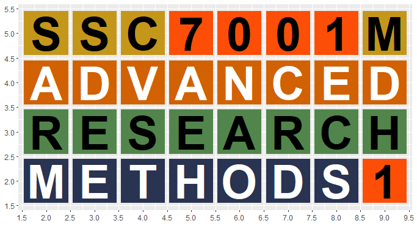

```{r setup, include=FALSE}
knitr::opts_chunk$set(echo = FALSE)

# Learn more about creating websites with Distill at:
# https://rstudio.github.io/distill/website.html

# Learn more about publishing to GitHub Pages at:
# https://rstudio.github.io/distill/publish_website.html#github-pages

```

```{css}
d-title {
    display: none;
}
```

<br><br>

<center>

</center>

### Welcome to **Advanced Research Methods 1**
This is a 10-week course on applied regression modelling for sociologists, first delivered at York St John University (UK). It uses the [`R`](https://www.r-project.org/about.html) programming language and the [`RStudio`](https://www.rstudio.com/) Integrated Development Environment. It takes a [Tidyverse](https://www.tidyverse.org/) approach to coding and relies heavily on [`R Markdown`](https://rmarkdown.rstudio.com/index.html) for scripting and reporting.

### Try out your `R` code here

<iframe width='100%' height='1000' src='https://rdrr.io/snippets/embed/?code=print(%22Hello%2C%20world!%22)' frameborder='0'></iframe>
